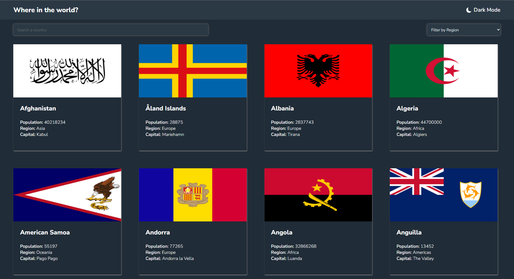

# Frontend Mentor - REST Countries API with color theme switcher solution

This is a solution to the [REST Countries API with color theme switcher challenge on Frontend Mentor](https://www.frontendmentor.io/challenges/rest-countries-api-with-color-theme-switcher-5cacc469fec04111f7b848ca). Frontend Mentor challenges help you improve your coding skills by building realistic projects. 

## Table of contents

- [Overview](#overview)
  - [The challenge](#the-challenge)
  - [Screenshot](#screenshot)
  - [Links](#links)
- [My process](#my-process)
  - [Built with](#built-with)
  - [What I learned](#what-i-learned)
  - [Continued development](#continued-development)
- [Author](#author)

## Overview

### The challenge

Users should be able to:

- See all countries from the API on the homepage
- Search for a country using an `input` field
- Filter countries by region
- Click on a country to see more detailed information on a separate page
- Click through to the border countries on the detail page
- Toggle the color scheme between light and dark mode *(optional)*

### Screenshot

### Links

- Solution URL: [Github](https://github.com/DavidAdjei/Frontend_Rest_Country_API)
- Live Site URL: [Vercel App](https://frontend-rest-country-api.vercel.app/)

## My process

### Built with

- Semantic HTML5 markup
- CSS custom properties
- Flexbox
- CSS Grid
- [React](https://reactjs.org/) - JS library

### What I learned

I used this project as an opportunity to learn react, and to my surprise it was quite interesting

### Continued development

React state management
React Native

## Author

- Frontend Mentor - [@DavidAdjei](https://www.frontendmentor.io/profile/DavidAdjei)
- Twitter - [@nharnahadjei2](https://twitter.com/nharnahadjei2)
- LinkedIn - [@David Adjei](https://www.linkedin.com/in/david-adjei-313a811a2/)